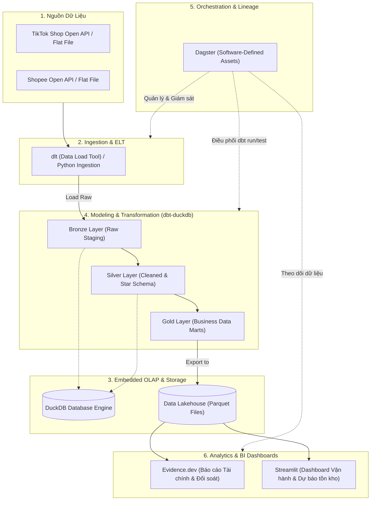
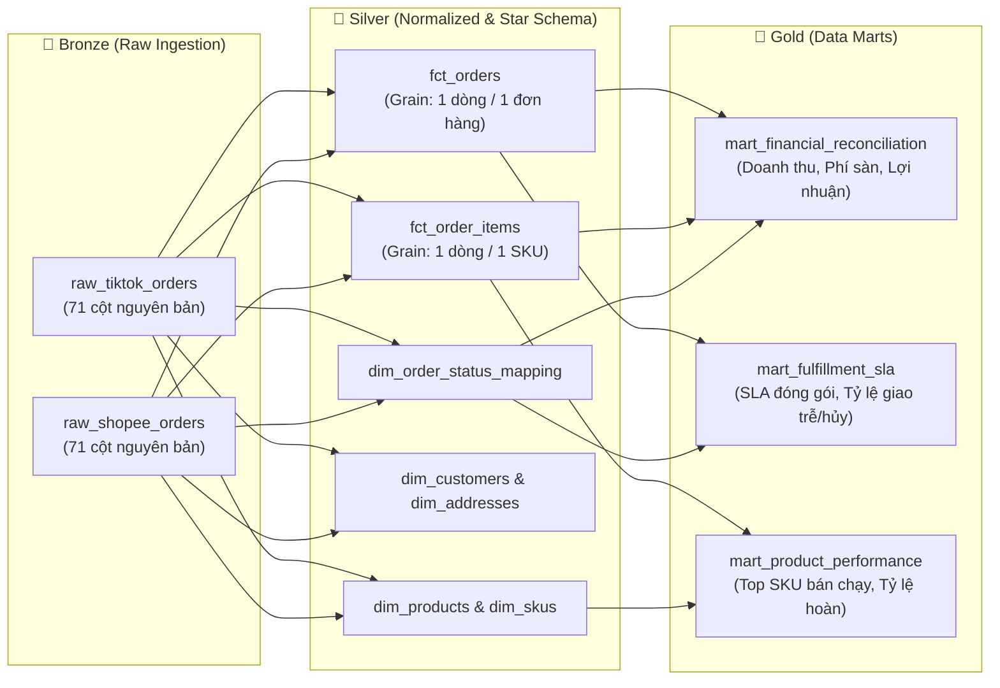

# 🚀 Multi-Channel E-Commerce Data Pipeline (TikTok Shop & Shopee Vietnam)

Hệ thống Data Pipeline & Data Warehouse hiện đại, tinh gọn (*Modern Data Stack in-a-Box*) phục vụ phân tích dữ liệu kinh doanh, vận hành và tài chính cho nhà bán lẻ đa kênh tại Việt Nam (TikTok Shop & Shopee).

---

## 📌 1. Bối cảnh & Thách thức Nghiệp vụ

Dữ liệu đầu vào bắt nguồn từ hệ thống đồng bộ đơn hàng (OMS / ERP / Open API) với cấu trúc **bảng phẳng 71 cột**:
* **Quy mô hiện tại:** 5.000 đơn Shopee + 2.000 đơn TikTok Shop (~100.000+ dòng chi tiết sản phẩm).
* **Đặc tính dữ liệu:**
  * Bảng phẳng ở mức hạt độ chi tiết (grain) là **Dòng sản phẩm (`Order Line Item`)**, nhưng đồng thời chứa các chỉ số cấp **Đơn hàng (`Order Header`)** như tổng tiền, phí sàn, giảm giá, phí ship.
  * Trạng thái đơn, mốc thời gian (SLA đóng gói, giao hàng, hủy) và mã voucher giữa Shopee và TikTok Shop có sự khác biệt về thuật ngữ và cơ chế ghi nhận.

### Các "bẫy" dữ liệu cần xử lý triệt để:
1. **Bẫy nhân đôi doanh thu (Fan-out Trap):** Nếu một đơn hàng có 3 món đồ, việc query `SUM(total_amount)` trực tiếp trên bảng phẳng sẽ làm doanh thu bị phóng đại gấp 3 lần. Cần chuẩn hóa theo mô hình Star Schema.
2. **Xung đột khóa chính giữa các sàn:** Cần sinh Surrogate Key dạng `channel + '_' + order_id` để tránh trùng lặp mã đơn.
3. **Chuẩn hóa trạng thái đơn (Order Status Mapping):** Ánh xạ trạng thái từ 2 sàn về một bộ trạng thái thống nhất (`Chờ đóng gói`, `Đang giao`, `Đã giao`, `Hủy`, `Trả hàng`).
4. **Đối soát tài chính (Reconciliation):** Tách bạch rõ Doanh thu danh nghĩa (Gross GMV), Chiết khấu sàn, Chiết khấu nhà bán, Phí vận chuyển và Doanh thu thực nhận.

---

## 🏗️ 2. Kiến trúc Tổng thể (Architecture Overview)

Pipeline được thiết kế theo triết lý **Modern Data Stack in-a-Box**: tối ưu hóa hiệu năng bằng xử lý cột (Columnar OLAP), chi phí hạ tầng 0 đồng (chạy trên local/VPS), không cần cụm máy chủ cồng kềnh.



---

## 🔄 3. Chi tiết Luồng Dữ liệu (Medallion & Star Schema Flow)



### Chi tiết các tầng dữ liệu:

| Tầng | Định dạng | Mục tiêu & Xử lý |
| :--- | :--- | :--- |
| **Bronze (Raw)** | Bảng DuckDB / Parquet thô | Giữ nguyên trạng 71 cột từ hệ thống đồng bộ. Bổ sung `_ingested_at`, `_source_channel` để phục vụ audit và truy vết lỗi. |
| **Silver (Cleansed)** | Star Schema Model | • Tách Header thành `fct_orders` và Item thành `fct_order_items`.<br>• Xử lý kiểu dữ liệu (`datetime2`, chuẩn hóa múi giờ `UTC+7`).<br>• Sinh Surrogate Keys (`hash(channel, order_id)`).<br>• Chuẩn hóa danh mục địa chỉ (Tỉnh/Thành phố, Quận/Huyện) và số điện thoại. |
| **Gold (Marts)** | Tối ưu hóa truy vấn BI | Tạo các bảng tổng hợp chỉ số nghiệp vụ: Doanh thu thực sau chiết khấu (Net GMV), Chi phí vận chuyển thực tế, Tỷ lệ vi phạm SLA giao hàng, Phân tích giỏ hàng. |

---

## ⚙️ 4. Lý do Lựa chọn Tech Stack

| Công nghệ | Vai trò | Tại sao chọn thay vì giải pháp truyền thống? |
| :--- | :--- | :--- |
| **DuckDB** | OLAP Engine | **Thay thế PostgreSQL / ClickHouse:** Xử lý dạng cột (columnar) cực nhanh cho câu lệnh phân tích/tổng hợp. Chạy in-process (không cần server riêng, RAM thấp, không tốn chi phí duy trì như ClickHouse). |
| **dbt-duckdb** | Data Transformation | Mang lại chuẩn mực công nghệ phần mềm vào dữ liệu: viết bằng SQL, quản lý version Git, tự động kiểm thử dữ liệu (`unique`, `not_null`, `relationships`), sinh documentation tự động. |
| **Dagster** | Orchestrator | **Thay thế Airflow:** Tiếp cận theo tư duy **Software-Defined Assets (SDA)** thay vì task-based. Tích hợp sâu với dbt, hiển thị data lineage chi tiết, debug cục bộ cực dễ bằng lệnh `dagster dev`. |
| **Parquet** | Data Lakehouse Storage | Lưu trữ dạng columnar mở. Giúp giải quyết triệt để vấn đề **Concurrency Lock** của DuckDB: dbt ghi ra Parquet, Streamlit/Evidence chỉ việc đọc Parquet độc lập mà không bao giờ bị khóa file. |
| **Evidence.dev / Streamlit** | BI & Dashboard | **Evidence.dev:** Báo cáo Markdown + SQL siêu nhanh, xuất báo cáo tài chính/đối soát có thể version-control qua Git.<br>**Streamlit:** Dashboard vận hành tương tác cao, hỗ trợ Python cho dự báo nhu cầu hoặc nhập liệu điều chỉnh. |

---

## 📁 5. Cấu trúc Thư mục Dự án Đề xuất

```text
Tiktok_orders_pipeline/
├── README.md
├── pyproject.toml              # Quản lý dependencies (uv / poetry / pip)
├── data/
│   ├── raw/                    # Chứa file export ban đầu (.csv, .xlsx, .json)
│   ├── duckdb/                 # File database local (local.duckdb)
│   └── gold/                   # Output parquet files cho tầng BI
├── dbt_transforms/             # Dự án dbt-duckdb
│   ├── dbt_project.yml
│   ├── profiles.yml
│   ├── models/
│   │   ├── staging/            # Bronze: raw staging
│   │   ├── intermediate/       # Silver: deduplication, status mapping
│   │   ├── marts/              # Gold: core business facts & dims
│   │   └── schema.yml          # Data contracts & tests
│   └── seeds/                  # Bảng mapping trạng thái (order_status_mapping.csv)
├── pipeline_orchestration/     # Dự án Dagster
│   ├── __init__.py
│   ├── assets/                 # Software-Defined Assets (Ingestion, dbt assets)
│   │   ├── raw_assets.py
│   │   └── dbt_assets.py
│   ├── repository.py
│   └── schedules.py
├── prefect_orchestration/      # Dự án Prefect (Lựa chọn thay thế Dagster)
│   └── dbt_flow.py             # Định nghĩa Flow chạy dbt build
└── dashboards/                 # Tầng BI & Báo cáo
    ├── evidence/               # Evidence.dev Markdown reports
    └── streamlit_app/          # Streamlit Interactive App
        └── app.py
```

---

## 📋 6. Trạng thái Dự án (Current Status)

Dự án đã triển khai thành công và hoàn thiện toàn bộ các tính năng cốt lõi:

- [x] **Giai đoạn 1: Khởi tạo & Dữ liệu**
  - Môi trường Python (uv), DuckDB, dbt-duckdb, Dagster, Streamlit.
  - Nạp dữ liệu e-commerce vào tầng Bronze (Raw).
- [x] **Giai đoạn 2: Mô hình hóa dữ liệu (dbt Core)**
  - Tách bảng Star Schema (Staging -> Intermediate -> Marts).
  - Viết dbt tests toàn vẹn dữ liệu (chặn trùng lặp, logic constraints).
- [x] **Giai đoạn 3: Điều phối Pipeline (Dagster)**
  - Tích hợp `dbt_assets` vào Data Orchestration UI.
  - Thiết lập lịch (Schedules) tự động chạy vào 7:00 sáng và 13:00 trưa hàng ngày (`0 7,13 * * *`).
- [x] **Giai đoạn 4: Trực quan hóa & Báo cáo (Streamlit)**
  - Dashboard tương tác đọc trực tiếp từ DuckDB.
  - Tối ưu hóa UI/UX: Dark Mode tương thích, Không Taskbar, Card CSS, biểu đồ tương quan, và Báo cáo dòng tiền.
