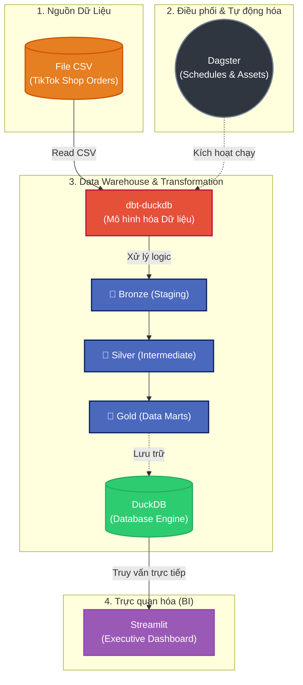
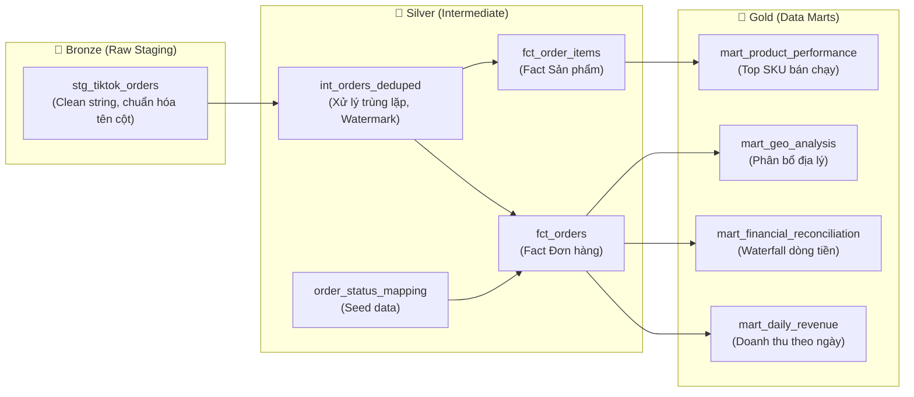

# 🚀 Multi-Channel E-Commerce Data Pipeline (TikTok Shop & Shopee Vietnam)

Hệ thống Data Pipeline & Data Warehouse hiện đại, tinh gọn (*Modern Data Stack in-a-Box*) phục vụ phân tích dữ liệu kinh doanh, vận hành và tài chính cho nhà bán lẻ đa kênh tại Việt Nam (TikTok Shop & Shopee).

---

## 📌 1. Bối cảnh & Thách thức Nghiệp vụ

Dữ liệu đầu vào bắt nguồn từ hệ thống đồng bộ đơn hàng (OMS / ERP / Open API) với cấu trúc **bảng phẳng 71 cột**:
* **Quy mô hiện tại:** 5.000 đơn Shopee + 2.000 đơn TikTok Shop (~100.000+ dòng chi tiết sản phẩm).
* **Đặc tính dữ liệu:**
  * Bảng phẳng ở mức hạt độ chi tiết (grain) là **Dòng sản phẩm (`Order Line Item`)**, nhưng đồng thời chứa các chỉ số cấp **Đơn hàng (`Order Header`)** như tổng tiền, phí sàn, giảm giá, phí ship.
  * Trạng thái đơn, mốc thời gian (SLA đóng gói, giao hàng, hủy) và mã voucher giữa Shopee và TikTok Shop có sự khác biệt về thuật ngữ và cơ chế ghi nhận.

### Các "bẫy" dữ liệu cần xử lý triệt để:
1. **Bẫy nhân đôi doanh thu (Fan-out Trap):** Nếu một đơn hàng có 3 món đồ, việc query `SUM(total_amount)` trực tiếp trên bảng phẳng sẽ làm doanh thu bị phóng đại gấp 3 lần. Cần chuẩn hóa theo mô hình Star Schema.
2. **Xung đột khóa chính giữa các sàn:** Cần sinh Surrogate Key dạng `channel + '_' + order_id` để tránh trùng lặp mã đơn.
3. **Chuẩn hóa trạng thái đơn (Order Status Mapping):** Ánh xạ trạng thái từ 2 sàn về một bộ trạng thái thống nhất (`Chờ đóng gói`, `Đang giao`, `Đã giao`, `Hủy`, `Trả hàng`).
4. **Đối soát tài chính (Reconciliation):** Tách bạch rõ Doanh thu danh nghĩa (Gross GMV), Chiết khấu sàn, Chiết khấu nhà bán, Phí vận chuyển và Doanh thu thực nhận.

---

## 🏗️ 2. Kiến trúc Tổng thể (Architecture Overview)

Pipeline được thiết kế theo triết lý **Modern Data Stack in-a-Box**: tối ưu hóa hiệu năng bằng xử lý cột (Columnar OLAP), chi phí hạ tầng 0 đồng (chạy trên local/VPS), không cần cụm máy chủ cồng kềnh.


```mermaid
flowchart TD
    %% Định nghĩa màu sắc (classDef)
    classDef source fill:#e67e22,stroke:#d35400,stroke-width:2px,color:#fff;
    classDef orchestrator fill:#2f3640,stroke:#718093,stroke-width:2px,color:#fff;
    classDef compute fill:#4a69bd,stroke:#0c2461,stroke-width:2px,color:#fff;
    classDef transform fill:#e55039,stroke:#b71540,stroke-width:2px,color:#fff;
    classDef storage fill:#2ecc71,stroke:#27ae60,stroke-width:2px,color:#fff;
    classDef bi fill:#9b59b6,stroke:#8e44ad,stroke-width:2px,color:#fff;

    subgraph Sources ["1. Nguồn Dữ Liệu"]
        CSV[("File CSV\n(TikTok Shop Orders)")]:::source
    end

    subgraph Orchestration ["2. Điều phối & Tự động hóa"]
        DAGSTER(("Dagster\n(Schedules & Assets)")):::orchestrator
    end

    subgraph DataPlatform ["3. Data Warehouse & Transformation"]
        DBT["dbt-duckdb\n(Mô hình hóa Dữ liệu)"]:::transform
        DUCKDB[("DuckDB\n(Database Engine)")]:::storage
        
        BRONZE["🥉 Bronze (Staging)"]:::compute
        SILVER["🥈 Silver (Intermediate)"]:::compute
        GOLD["🥇 Gold (Data Marts)"]:::compute
        
        DBT -->|Xử lý logic| BRONZE --> SILVER --> GOLD
        GOLD -.->|Lưu trữ| DUCKDB
    end

    subgraph Consumption ["4. Trực quan hóa (BI)"]
        STREAMLIT["Streamlit\n(Executive Dashboard)"]:::bi
    end

    CSV -->|Read CSV| DBT
    DAGSTER -.->|Kích hoạt chạy| DBT
    DUCKDB -->|Truy vấn trực tiếp| STREAMLIT
```

---

## 🔄 3. Chi tiết Luồng Dữ liệu (Medallion & Star Schema Flow)


```mermaid
flowchart LR
    subgraph Bronze ["🥉 Bronze (Raw Staging)"]
        stg_tt["stg_tiktok_orders\n(Clean string, chuẩn hóa tên cột)"]
    end

    subgraph Silver ["🥈 Silver (Intermediate)"]
        int_dedup["int_orders_deduped\n(Xử lý trùng lặp, Watermark)"]
        fct_orders["fct_orders\n(Fact Đơn hàng)"]
        fct_items["fct_order_items\n(Fact Sản phẩm)"]
        dim_status["order_status_mapping\n(Seed data)"]
    end

    subgraph Gold ["🥇 Gold (Data Marts)"]
        mart_fin["mart_financial_reconciliation\n(Waterfall dòng tiền)"]
        mart_rev["mart_daily_revenue\n(Doanh thu theo ngày)"]
        mart_prod["mart_product_performance\n(Top SKU bán chạy)"]
        mart_geo["mart_geo_analysis\n(Phân bổ địa lý)"]
    end

    stg_tt --> int_dedup
    int_dedup --> fct_orders
    int_dedup --> fct_items
    dim_status --> fct_orders

    fct_orders --> mart_rev
    fct_orders --> mart_fin
    fct_items --> mart_prod
    fct_orders --> mart_geo
```

### Chi tiết các tầng dữ liệu:

| Tầng | Định dạng | Mục tiêu & Xử lý |
| :--- | :--- | :--- |
| **Bronze (Raw)** | Bảng DuckDB / Parquet thô | Giữ nguyên trạng 71 cột từ hệ thống đồng bộ. Bổ sung `_ingested_at`, `_source_channel` để phục vụ audit và truy vết lỗi. |
| **Silver (Cleansed)** | Star Schema Model | • Tách Header thành `fct_orders` và Item thành `fct_order_items`.<br>• Xử lý kiểu dữ liệu (`datetime2`, chuẩn hóa múi giờ `UTC+7`).<br>• Sinh Surrogate Keys (`hash(channel, order_id)`).<br>• Chuẩn hóa danh mục địa chỉ (Tỉnh/Thành phố, Quận/Huyện) và số điện thoại. |
| **Gold (Marts)** | Tối ưu hóa truy vấn BI | Tạo các bảng tổng hợp chỉ số nghiệp vụ: Doanh thu thực sau chiết khấu (Net GMV), Chi phí vận chuyển thực tế, Tỷ lệ vi phạm SLA giao hàng, Phân tích giỏ hàng. |

---

## ⚙️ 4. Lý do Lựa chọn Tech Stack

| Công nghệ | Vai trò | Tại sao chọn thay vì giải pháp truyền thống? |
| :--- | :--- | :--- |
| **DuckDB** | OLAP Engine | **Thay thế PostgreSQL / ClickHouse:** Xử lý dạng cột (columnar) cực nhanh, truy vấn trực tiếp file CSV. Chạy in-process (không cần server riêng). |
| **dbt-duckdb** | Data Transformation | Tự động hóa quá trình làm sạch và chia tầng dữ liệu. Có sẵn cơ chế test (unique, not_null) và quản lý bằng Git. |
| **Dagster** | Orchestrator | **Thay thế Airflow:** Tiếp cận theo tư duy Software-Defined Assets (SDA). Lên lịch chạy tự động, hiển thị rõ luồng lineage từ file CSV đến Data Mart. |
| **Streamlit** | BI Dashboard | Dùng Python thuần túy để xây dựng dashboard Premium với Plotly (nhẹ, nhanh, không cần cài cắm server rườm rà như Metabase / Superset). |

---

## 📁 5. Cấu trúc Thư mục Dự án Đề xuất

```text
Tiktok_orders_pipeline/
├── README.md
├── pyproject.toml              # Quản lý dependencies (uv)
├── data/
│   ├── raw/                    # Chứa file CSV đầu vào (Tiktok_ecommerce.csv)
│   └── duckdb/                 # Nơi lưu database ecom_warehouse.duckdb
├── dbt_transforms/             # Data Warehouse Transformation
│   ├── dbt_project.yml
│   ├── models/
│   │   ├── staging/            # Tầng Bronze
│   │   ├── intermediate/       # Tầng Silver
│   │   └── marts/              # Tầng Gold (Business logic)
│   └── seeds/                  # order_status_mapping.csv
├── pipeline_orchestration/     # Dagster Orchestrator
│   └── ...                     # Code định nghĩa Assets & Lịch trình
└── dashboards/
    └── streamlit_app/          # Streamlit Single Page Dashboard (app.py)
```

---

## 📋 6. Trạng thái Dự án (Current Status)

Dự án đã triển khai thành công và hoàn thiện toàn bộ các tính năng cốt lõi:

- [x] **Giai đoạn 1: Khởi tạo & Dữ liệu**
  - Môi trường Python (uv), DuckDB, dbt-duckdb, Dagster, Streamlit.
  - Nạp dữ liệu e-commerce vào tầng Bronze (Raw).
- [x] **Giai đoạn 2: Mô hình hóa dữ liệu (dbt Core)**
  - Tách bảng Star Schema (Staging -> Intermediate -> Marts).
  - Viết dbt tests toàn vẹn dữ liệu (chặn trùng lặp, logic constraints).
- [x] **Giai đoạn 3: Điều phối Pipeline (Dagster)**
  - Tích hợp `dbt_assets` vào Data Orchestration UI.
  - Thiết lập lịch (Schedules) tự động chạy vào 7:00 sáng và 13:00 trưa hàng ngày (`0 7,13 * * *`).
- [x] **Giai đoạn 4: Trực quan hóa & Báo cáo (Streamlit)**
  - Đã xây dựng hoàn chỉnh Executive Dashboard dạng Single Page Scroll.
  - Tích hợp biểu đồ Plotly sang trọng (Waterfall, Area, Scatter).
